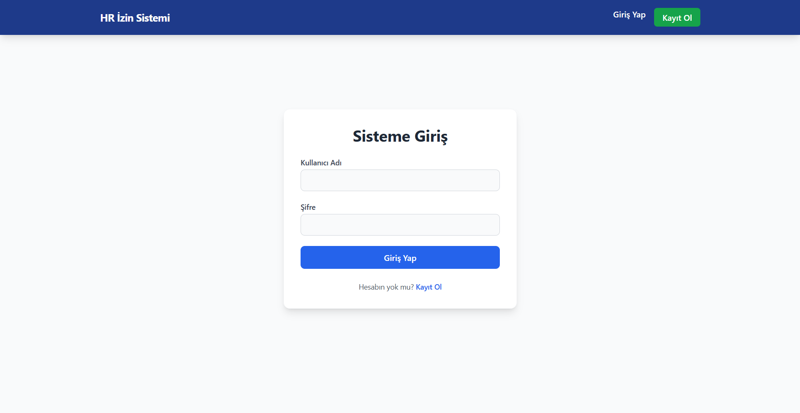
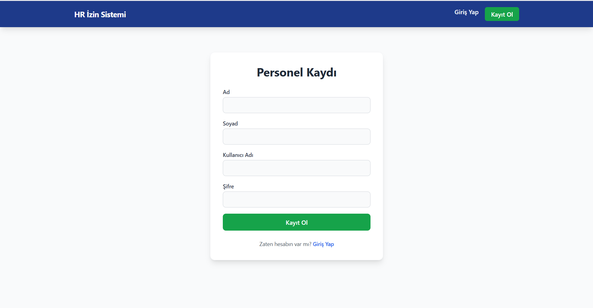
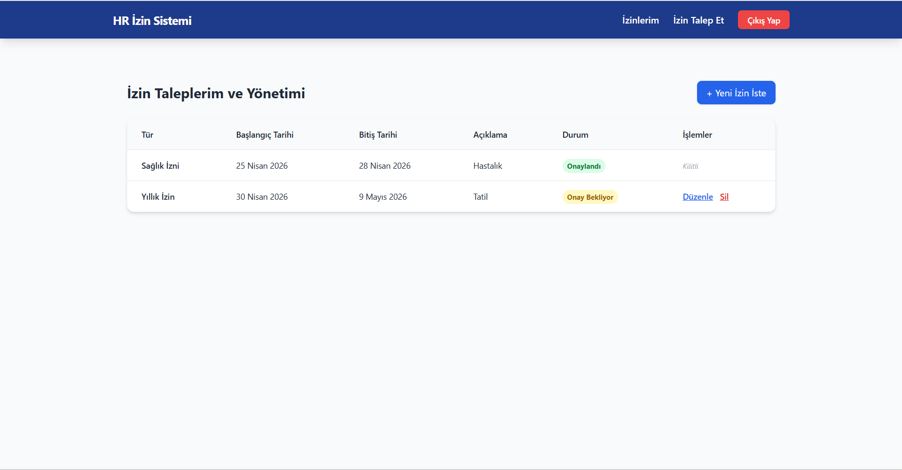
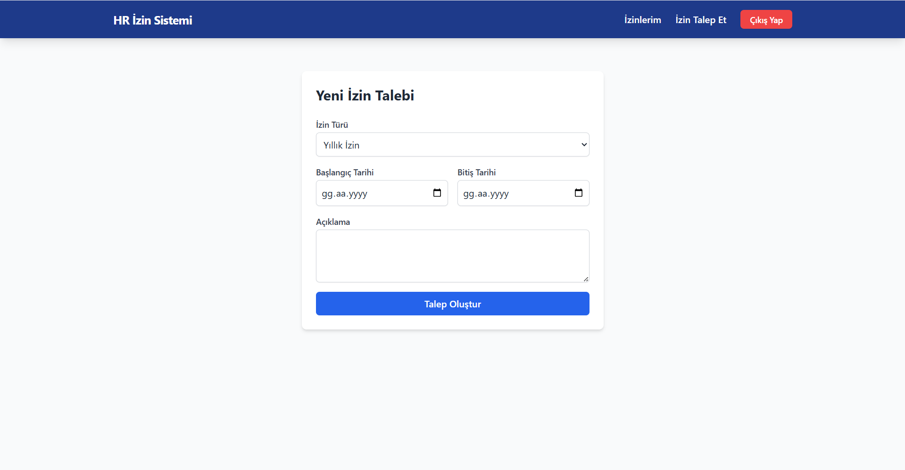
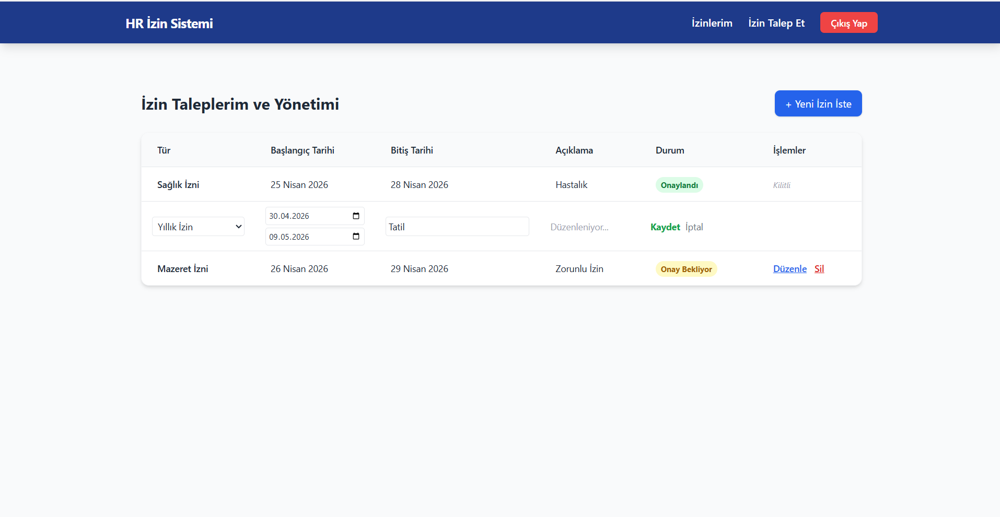
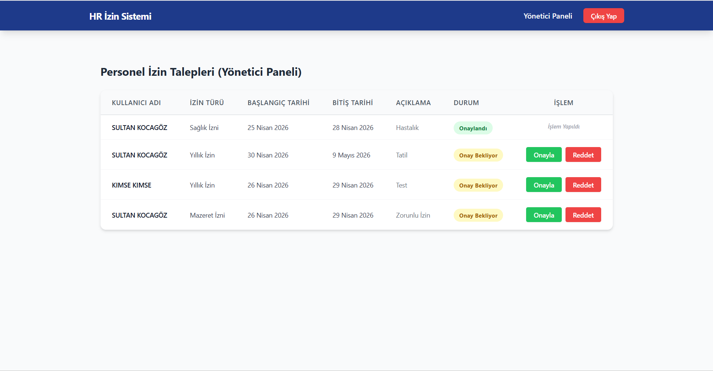
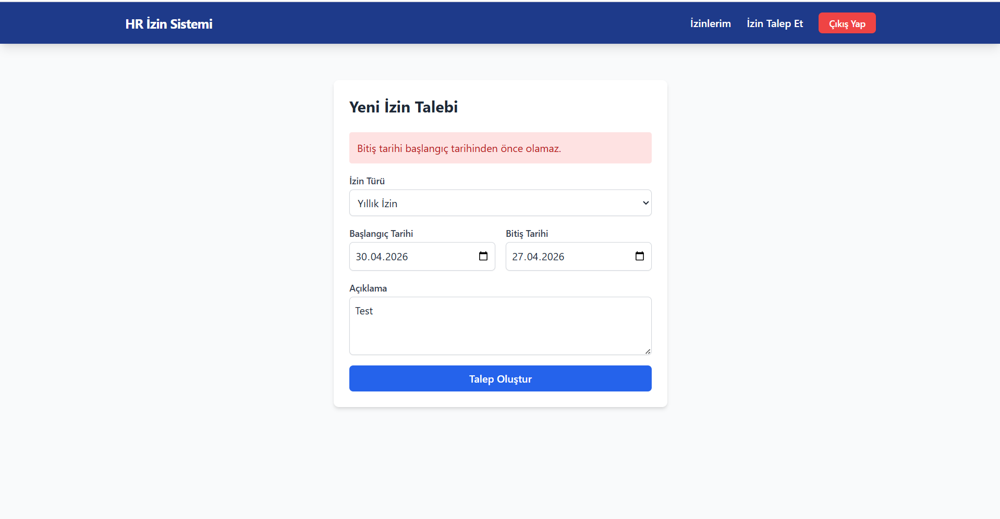

# Personel İzin Talebi Sistemi
Bu proje; şirket içi personel izin süreçlerini dijitalleştiren, hem personel hem de yönetici arayüzü bulunan tam kapsamlı bir web uygulamasıdır.

## Teknolojiler
- Backend: FastAPI
- Frontend: React, Vite, Tailwind CSS, Axios
- Database: SQLite
- Versiyon Kontrol: Alembic (Database Migrations)
- Güvenlik: JWT (JSON Web Token), Bcrypt Password Hashing

## Ekran Görüntüleri

  

  

  
     

## API Dokümantasyonu
Teknoloji: Swagger   
   

## Ön Gereksinimler

Projeyi çalıştırmadan önce bilgisayarınızda aşağıdaki ortamların kurulu olduğundan emin olun:
- **Node.js:** v18.0.0 veya üzeri (Frontend için)
- **Python:** v3.9 veya üzeri (Backend için)
- **npm:** v9.0.0 veya üzeri
  
## Nasıl Çalışır?

**Backend**
-Backend klasörüne gidin: cd Backend
-Sanal ortam oluşturun: python -m venv .venv
-Aktif edin: .venv\Scripts\activate
-Paketleri kurun: pip install -r requirements.txt
-Başlatın: uvicorn main:app --reload

**Frontend**
-Frontend klasörüne gidin: cd Frontend
-Paketleri kurun: npm install
-Başlatın: npm run dev

**Database**
-SQLite kullanıldığı için backend adımları tamamlandığında izin_talebi_database.db dosyası oluşacak. Bu dosyayı uygun bir database management uygulamasında(DBeaver) açarak database tablolarına ulaşabilirsiniz.

**API Dokümantasyon**
-Swagger: Tarayıcınıza uvicorn main:app --reload komutunu çalıştırdıktan sonra gelen url'i girin ve "/docs" endpointini ekleyin. (http://127.0.0.1:8000/docs)

